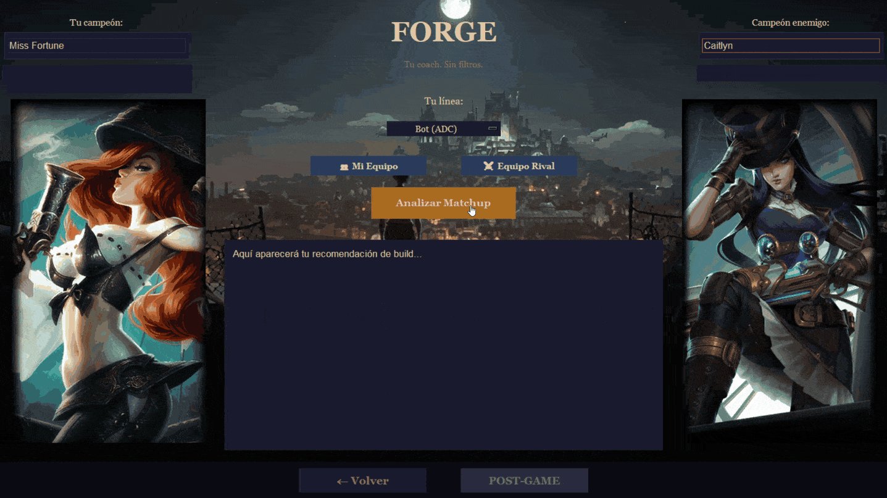

# Forge
### *An AI coach for League of Legends that tells you what to do — not just what happened*

Forge is a desktop coaching app for League of Legends. It analyzes your matchup before the game starts and delivers direct, actionable guidance: runes, starting items, level 1-6 gameplan, first core item, and the one thing that decides your lane.

Stats sites tell you *what happened*. Forge tells you *what to do about it*.

<!-- DEMO GIF HERE:  -->

---

## What it does

- **Pre-Game analysis** — enter your champion, your lane opponent, and your role. Forge returns a matchup-specific gameplan generated by Claude: keystone and secondary tree, starting items, ability order, early-game mechanics, and a no-nonsense matchup tip
- **Player profile integration** — link your Riot ID and Forge pulls your rank, level, and recent history through the Riot API to personalize its advice
- **Adaptive tone** — a short onboarding survey detects whether you're new, returning, or active, and the coaching adjusts its depth accordingly
- **Smart champion search** — predictive text from the first letter, partial-name detection, and automatic role validation with warnings for off-meta picks
- **Full team context** — optionally register both team compositions for analysis that accounts for all ten champions
- **Live splash art UI** — champion loading-screen art pulled from Riot's Data Dragon CDN at runtime

## The coaching philosophy

Forge's coach persona is deliberately harsh: it points out what you're doing wrong and, in the same sentence, tells you exactly what to do instead. Every criticism comes with an actionable instruction. No filler, no generic advice.

---

## Stack

| Layer | Technology |
|---|---|
| Coaching engine | Claude (Anthropic API) — model configurable |
| Game data | Riot Games API + Data Dragon CDN |
| UI | Python + Tkinter (pure, single-canvas architecture) |
| Distribution | PyInstaller portable .exe |

---

## Setup

### Requirements

- Python 3.12 (⚠ not 3.14 — alpha versions break Pillow/ImageTk rendering)
- A [Riot API key](https://developer.riotgames.com) (free)
- An [Anthropic API key](https://console.anthropic.com)

### Install

```bash
pip install anthropic requests pillow python-dotenv speechrecognition pyttsx3
```

### Configure

Copy `.env.example` to `.env` next to the script (or next to the .exe) and fill in your keys.

Optional: place any `fondo.jpg` image next to the script to use as background. Without it, Forge runs on a solid dark theme.

### Run

```bash
py -3.12 lol_coach_API.py
```

Or download the portable `.exe` from [Releases](../../releases) — no Python required. Just place your `.env` file next to it.

---

## Roadmap

- **Post-Game analysis** — match-by-match decision review using Riot match data: not *what* your stats were, but *why* you lost
- In-game voice coaching (prototype exists, frozen pending latency work)
- Community champion nicknames support

---

*Forge isn't endorsed by Riot Games and doesn't reflect the views or opinions of Riot Games or anyone officially involved in producing or managing Riot Games properties.*

---

## Built by

Antonio R — [github.com/Tyrunt-A](https://github.com/Tyrunt-A) · Also check out [Recall](https://github.com/Tyrunt-A/Recall), a persistent-memory conversational agent
